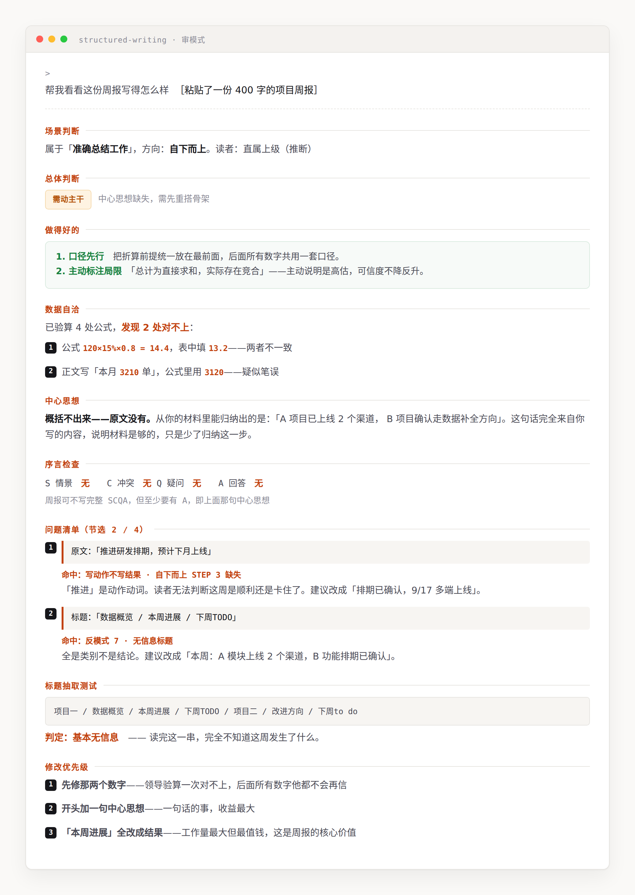

# 结构化写作 · structured-writing

把职场文档搭成「结论先行、以上统下、归类分组、逻辑递进」的金字塔。
核心主张：**先搭骨架，再下笔。**

方法论源自 Barbara Minto 的《金字塔原理》。本插件把这套原理操作化成
AI agent 可执行的流程、检查表与输出契约，不是原书复述。



> 上图：对一份周报跑「审」模式的实际输出。八段格式固定，每条问题都引用原文。

## 安装

**Claude Code**

```bash
git clone https://github.com/guishiru/structured-writing.git ~/.claude/plugins/structured-writing
```

或克隆到任意目录后，在 Claude Code 里用 `/plugin` 安装本地目录。

**Cowork**

下载 [Releases](https://github.com/guishiru/structured-writing/releases) 里的
`structured-writing.plugin` 文件，拖进对话即可安装。

装好后直接说话触发，不需要记命令。

**下载页**

项目提供一个可部署到 GitHub Pages 的下载页：

```text
https://guishiru.github.io/structured-writing/
```

启用 Pages 工作流后，下载页会自动读取最新 Release，并显示插件资产的 GitHub 下载次数。
如果需要记录页面访问和下载按钮点击，请先按
[`worker/README.md`](worker/README.md) 部署统计 Worker，再把 Worker 地址填入
`site/config.js`。

## 发布插件

把 `.claude-plugin/plugin.json` 的版本号更新为新版本，再创建并推送同名的
`v*` 标签后，GitHub Actions 会自动打包并上传
`structured-writing.plugin` 到对应的 Release：

```bash
# 先把 .claude-plugin/plugin.json 的 version 改为 0.2.2
git tag v0.2.2
git push origin v0.2.2
```

本地也可以先检查安装包：

```powershell
./scripts/package-plugin.ps1
```

---

## 它能做什么

### 三种模式

| 模式 | 你说什么 | 它做什么 |
|---|---|---|
| **写** | 「帮我写个 Q3 增长复盘，给事业部总经理看」 | 先问清目标和读者 → 给出骨架（中心思想 + 3-4 条关键句 + SCQA 序言）→ **停下来等你确认** → 才成稿 |
| **审** | 贴一份稿子，「帮我看看」 | 返回八段诊断：场景判断 / 总体判断 / 做得好的 / 数据自洽 / 中心思想 / 序言检查 / 问题清单 / 修改优先级。**不动你的原文** |
| **改** | 「按金字塔重构一下这份稿子」 | 重搭结构 + 改动说明 + 改前改后对照。保留你的语气，不增加信息 |

### 四类场景，四条流水线

不是同一套流程换个说法——**「准确总结工作」走的是自下而上**，
先摊开事实再归纳结论；其余三类是自上而下。

| 场景 | 三个 STEP |
|---|---|
| 清晰传递信息 | 设计标题 → 撰写序言 → 展开内容 |
| **准确总结工作** | 成果分类 → 排序整理 → 概括总结 |
| 充分说服他人 | 明确观点 → 疑问回答 → 逻辑归整 |
| 有力汇报方案 | 底层逻辑 → 五步骤展开 |

### 八项反模式诊断

审模式的核心。每条都给「长相 → 为什么是问题 → 怎么改」：

1. 空洞的类别句（「存在 3 个问题」）
2. 结论被埋或缺失（核心结论在结语里，或压根没有）
3. 分组不 MECE（重叠、遗漏、或维度不统一）
4. 序言塞了读者不知道的信息
5. 同一组混用排序逻辑
6. 层级超载（单层超 7 项 / 演绎链超 4 步）
7. 无信息标题（「背景」「现状」「本周进展」）
8. 平行结构不对称（项目一三节、项目二两节）

### 数据自洽检查

审稿时先于结构诊断执行，因为**算术错误比结构问题更急**：公式代入验算、
同一个数出现两次比对、分项之和与总计核对、百分比加总、时间与单位一致性。

只报「对不上」，不报「数字本身对不对」——外部事实验证不了，前后是否自洽验证得了。

### 标题抽取测试

强制步骤。把所有标题抽出来连成一串单独读，看能不能拿到完整论证。
拿不到就说明标题是类别不是结论。抽出来的那一串会原样写进报告。

### 六个工具表

识别概括技术 · 关系→图示对照 · 5W2H 问题描述 · 定主题检查表 ·
5W2H 疑问回答框架 · 现有结构库（SWOT / 6M / 4P / 2×2 矩阵等现成的「筐」）

---

## 触发方式

自动触发，说这些话就行：

> 帮我写个汇报 / 周报 / 方案 / 总结
> 帮我理一下逻辑
> 这个怎么讲更清楚
> 一页纸说清楚 / 三分钟讲完
> 给领导看的
> 帮我看看这篇写得怎么样
> 结构化一下 / 用金字塔原理 / SCQA / MECE / 结论先行

---

## 它不做什么

遇到这些会明确告诉你不适用，然后按你本来的需求正常处理：

- **叙事性文档**：事故时间线、会议纪要、访谈记录、操作手册、教程
- **创意与情感类**：公众号推文、文案、致谢信、慰问、道歉信
- **参考手册类技术文档**：API 文档、配置项说明、参数表、代码注释
- 已经很短且结构清楚的内容

**边界**：讲清「某个系统为什么这样设计」的技术说明文**是适用的**——它有论点、有论据、
要说服读者。判断依据是「读者是通读还是查阅」：通读的适用，查阅的不适用。

另外：对写得不错的稿子会直接说「结构没问题」，不为了显得有用而硬找问题。

---

## 几条设计上的取舍

**先骨架后成稿**，是因为直接吐三千字，方向错了就全废；
先给一句中心思想加三条关键句，二十秒就能判断对不对。
明确说「直接给我成稿」可以跳过这一步。

**审的时候绝不改写**，是因为把一次评审变成一次重写，等于夺权。
看完诊断说「按你说的改」，才会动手。

**改的时候保留你的语气**。这套方法管结构，不管文风。
不会把你的周报改成公文腔。

**不编造**。事实、数字、引语只能来自你给的材料，
缺了就标 `【待补：...】`，不会填一个看起来合理的数。
发现你的公式算错了也不会替你改数，只会标出来让你确认。

**判定按改动成本，不按问题类型**。「结论写在结语里」听起来严重，
但如果修复只是把结语挪到开头，那就判「局部调整」而不是「需动主干」。
判定传达的是你要花多少力气。

**写得好会说好**。报告里有专门一段【做得好的】，而且要说清为什么这样做是对的。
只报问题不报优点，是这类工具最招人烦的地方。

---

## 内容出处

| 内容 | 出处 |
|---|---|
| 结论先行、以上统下、归类分组、逻辑递进四条原则 | Barbara Minto《金字塔原理》 |
| SCQA 序言结构、MECE、演绎与归纳、三种排序 | 同上 |
| 「论、证、类、比」中文口诀、五步骤流程、四类场景三 STEP | 本项目对上述原理的操作化组织 |
| 写/审/改三模式、八项反模式、数据自洽检查、输出契约 | 本项目原创设计 |
| 工具 2「关系→图示对照表」 | 本项目整理的通用对照，不对应任何特定教材 |

### 声明

本项目是**独立的第三方实现**，与 Barbara Minto 或 Minto International
**无任何关联，也未获得其认可或授权**。

本项目**不复制、不摘录、不替代**《金字塔原理》原著。它把这套公开的方法论框架
（概念名称、原则划分、检查维度）重新组织成 AI agent 可执行的指令，
所有说明文字、示例、反模式描述、输出契约均为原创撰写。

想系统学习这套方法，请阅读原著：**Barbara Minto《金字塔原理》**。

本项目按 MIT 协议开源，仅涵盖本仓库自身的代码与文字。

---

## 文件结构

```
structured-writing/
├── .claude-plugin/plugin.json
├── README.md
├── LICENSE
├── docs/example-audit.png    审阅报告示例截图
└── skills/structured-writing/
    ├── SKILL.md              调度层：模式判断、场景路由、四条自检标准、全局硬规则
    └── references/
        ├── write.md          写模式：五步骤完整展开
        ├── audit.md          审模式：八项反模式 + 数据自洽检查 + 八段报告格式
        ├── revise.md         改模式：重构流程 + 改前改后对照
        ├── scenarios.md      四类场景 × 三 STEP
        ├── tools.md          六个工具表
        └── presentation.md   PPT 标题规则、文字图表比、领导三分钟
```

## 更新记录

**v0.2.0** —— 用两份真实文档（一篇技术说明文、一份周报）实测后修订：

- 输出格式加【做得好的】和【数据自洽】两段
- 三档判定从「按问题类型」改为「按改动成本」
- 标题抽取测试从一句验收口径升级为强制诊断步骤
- 新增反模式 8「平行结构不对称」
- 新增数据自洽检查（实测中抓到两处算术错误，比所有结构问题都急）
- 强化「准确总结工作」场景的动作 vs 结果判定（附动作动词 / 结果动词对照）
- 澄清技术文档边界：通读的说明文适用，查阅的参考手册不适用
- 修掉 SKILL.md 自己的四个无信息标题（它没通过自己的反模式 7）

**v0.2.1** —— 出处统一归到《金字塔原理》。

**v0.1.0** —— 首版。

MIT License
